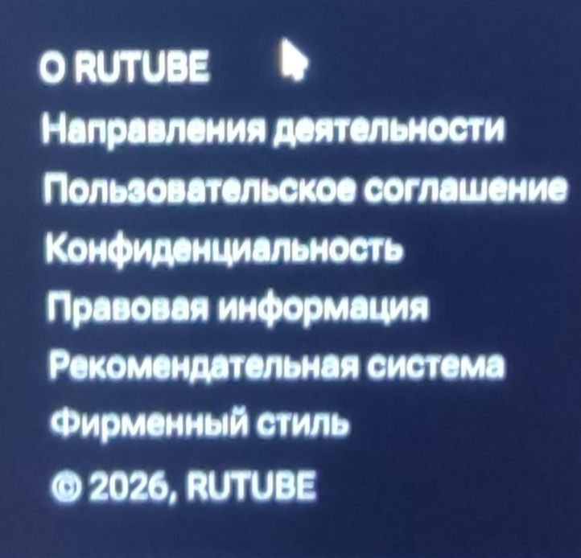

Смотри, несколько нюансов:
Во-первых, сделай шапку сайта, чтобы было понятно, куда именно зашёл пользователь.
Сделай наравне с тёмной темой сайта светлую, чтобы пользователь сам выбирал.
Сделай сортировку/фильтр по названию,популярности и т.п.
Сделай для примера кликабельными ещё пару вкладок, может, ещё добавить "Популярное"?

Внизу тоже добавь шапку, как здесь:
